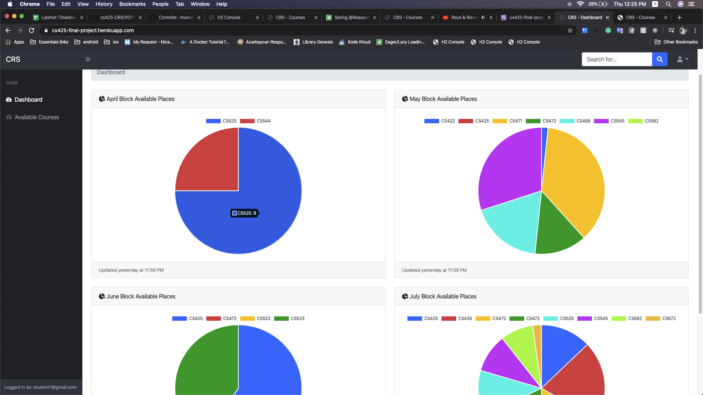

### Course Registration System

**HEROKU**: https://cs425-final-project.herokuapp.com/

**GITHUB**: https://github.com/muradhajiyev/cs425-CRS

**<u>Credentials</u>**: 

**Login**: student1
**Pass**: 123456

**Scenario**: 

​**Admin**:

   1. Manage faculties

   2. Manage faculty members

   3. Manage courses

   4. Manage classes

   5. Manage blocks

      

 **Student:**

   1. Enroll a course per block. If there is no available seats and student does not fullfill preprequisite can not enroll. 
   2. Dashboard - simple dashboard to check available places for each course in seperated blocks.

**Used Tecnologies**: 

1) Spring Security for role-based authentication 

2) Database - H2

3) Thymeleaf

4) JPA (Hibernate)

